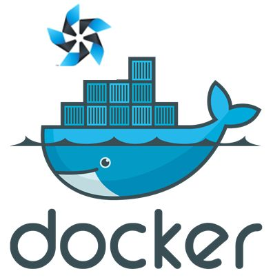

# dockzen #

> We are researching about tizen containers, light-weight host os which is desinged for docker in embedded system and remote web control such as update and monitoring.

### Quick-Start ###

- version 1.0 : ARM  
[Install dockzen packages with your OS](./install/v1.0/README_wo_dockzen.md)  
[Install with dockzen-OS](./install/v1.0/README_wi_dockzen.md)

### Sample Tizen Containers ###
- [https://hub.docker.com/u/dockzen/](https://hub.docker.com/u/dockzen/)

### Git Repositories ###
- Dockzen Host OS : 
- Docker-engine : 
	- 
- Dockzen Framework : 
	- 

### Target Kernels ###
- Raspi3 kernel : 
- Artik710 Kernel : 
  
    
